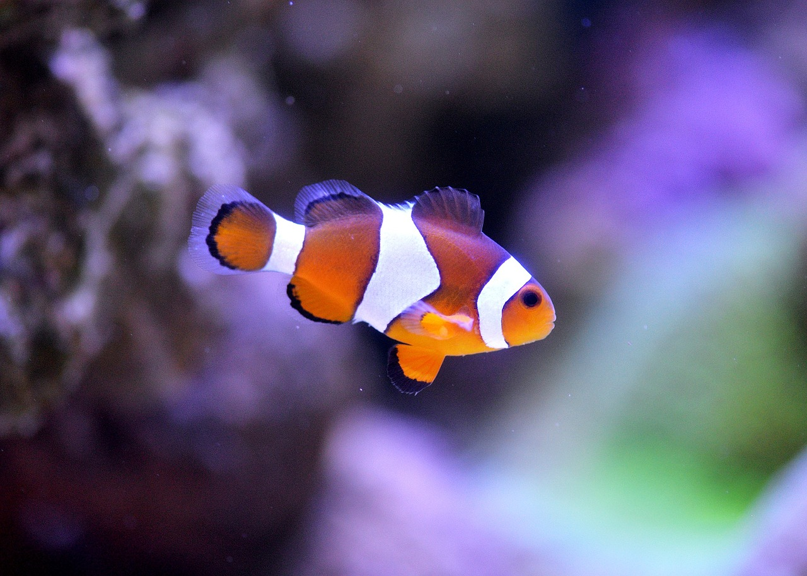

# Kevin Pendergast's IASC 2P02 Blog
## Bio

I am a 21 year old second year Interactive Arts and Science student attedning Brock University. Currently learning about ways the humanities can be performed effectively in today's digital age.

[Blog post](

Novels and Genres Evolution in the Early 

Lorem ipsum dolor sit amet, consectetur adipiscing elit. Nullam blandit interdum porttitor. Maecenas sed diam nec purus semper dictum. Nulla facilisi. Maecenas placerat diam ex, in ornare massa euismod egestas. Curabitur congue accumsan tortor, id ultrices ipsum finibus nec. Pellentesque et metus vitae quam sodales ullamcorper vitae non ipsum. Donec ornare mauris lacus, sit amet venenatis urna ultrices vel. Integer augue lacus, elementum nec ultrices ac, mattis nec mauris. In nec eros magna. Ut faucibus, libero vel auctor sagittis, risus massa dictum neque, et faucibus risus ante et mi. Proin varius placerat tincidunt. Nullam sed odio orci.

[Sharkbait! Ooh ha ha!](https://en.wikipedia.org/wiki/Finding_Nemo)

Pellentesque ac gravida diam. Maecenas nec turpis id dui viverra facilisis. Donec vel est nec lectus cursus euismod sed eu erat. Fusce venenatis malesuada ultrices. Nunc porta lobortis dui, egestas ornare lorem placerat eget. Nam finibus libero quis nisl pharetra, ut maximus quam varius. Aliquam malesuada sed odio sed feugiat. Vivamus eros justo, hendrerit sit amet lacus et, maximus tempor dolor. Fusce molestie laoreet magna, non dictum ante commodo vel. Ut varius bibendum sodales. Mauris sagittis a quam at varius. Pellentesque pulvinar turpis consectetur neque sodales laoreet.

